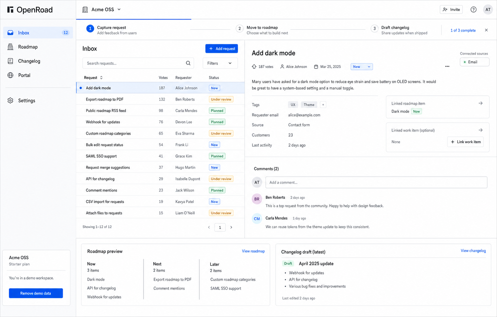
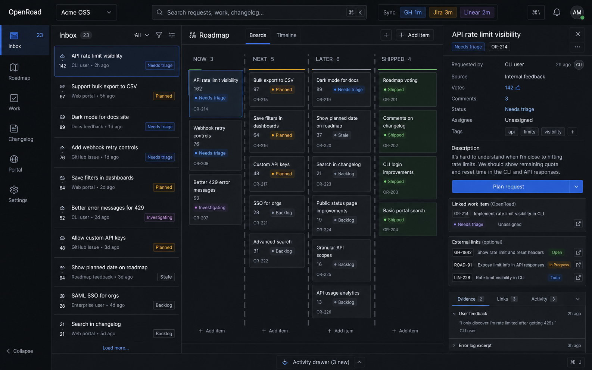
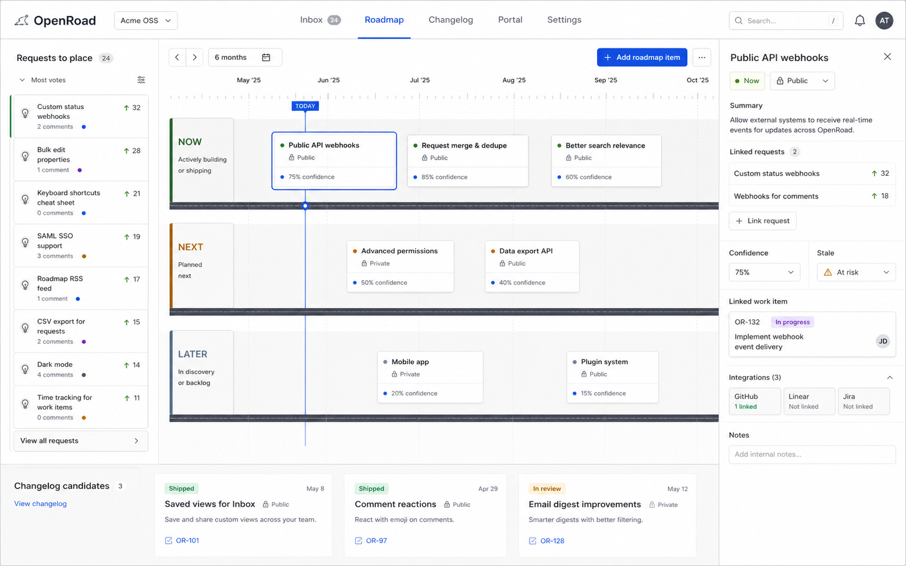
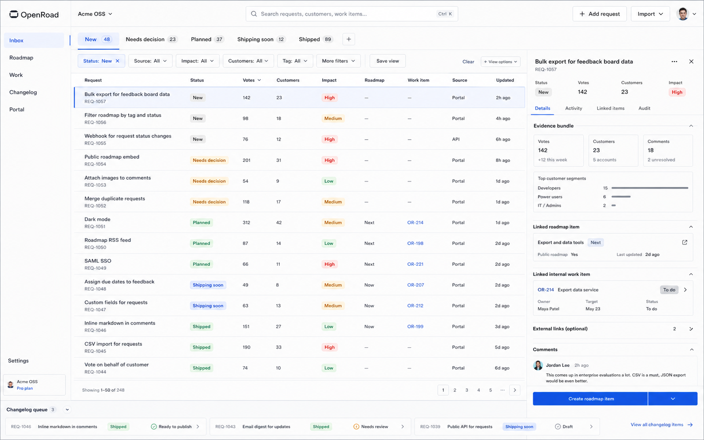

# OpenRoad UI Concepts

This file tracks dashboard concept exploration. Generated images should be copied into `design/concepts/` and referenced here.

## Decision

Selected direction: **Dark Map Room**.

OpenRoad will use a fully dark Workbench Plate and Map Room hybrid as the main product shell and identity. This supersedes the first Signal Rail implementation because that version still looked too close to a generic AI-generated dashboard. Concept C, Route Board, remains the preferred reference for the future Roadmap screen. Calm mode remains required as the default density so first-time users are not dropped into a dense cockpit.

## Concept A: Calm Desk

Light, beginner-safe, default OpenRoad. The main flow is Inbox to Roadmap to Changelog, with integrations visible only as small optional status context. Best for first-time users and teams leaving spreadsheets.

Strength: easiest first-use experience. Risk: may feel less distinctive for power users unless Dense mode is strong later.

## Concept B: Signal Rail

Dark, command-oriented workbench. Strong for power users, founders, maintainers, and engineering-heavy teams. It keeps the dense inspector model but hides debug/sync complexity until selected.

Strength: strongest brand memory and developer-tool feel. Risk: should not be the default for beginners unless Calm mode exists.

Decision: deprecated as the first implementation direction. Keep the command/workbench speed, but avoid the rounded dark-dashboard treatment.

## Active Direction: Dark Map Room

Dark, hard-edged, route-led product shell. It merges Workbench Plate structure with Map Room topology: square route index, command band, request ledger with route nodes, inspector spec sheet, map-like roadmap lanes, and release stamps.

Strength: strongest break from generic SaaS/card-dashboard visuals while preserving developer-tool seriousness.
Risk: can become too dense if every surface uses route notation at once; keep the default screen calm and progressively reveal power tools.

## Concept C: Route Board

Roadmap-first planning view with Now, Next, Later lanes as the center of the product. Best for teams that mainly need to communicate status and reduce roadmap confusion.

Strength: communicates the OpenRoad metaphor clearly. Risk: request triage may feel secondary if this becomes the main default.

## Concept D: Ledger Console

Table-first operational dashboard. Best for support, PM, and customer success teams who need to process many requests, see evidence, and avoid losing feedback in spreadsheets.

Strength: best for high-volume teams and spreadsheet replacement. Risk: can become visually heavy if Calm mode is not preserved.

## Selection Criteria

Choose the direction that best satisfies:

- First-time user understands it in five seconds.
- Standalone mode feels complete.
- Integrations feel useful but optional.
- Default UI does not exceed cognitive load.
- Power users can grow into speed and density.
- Public/private state is visible where it matters.
